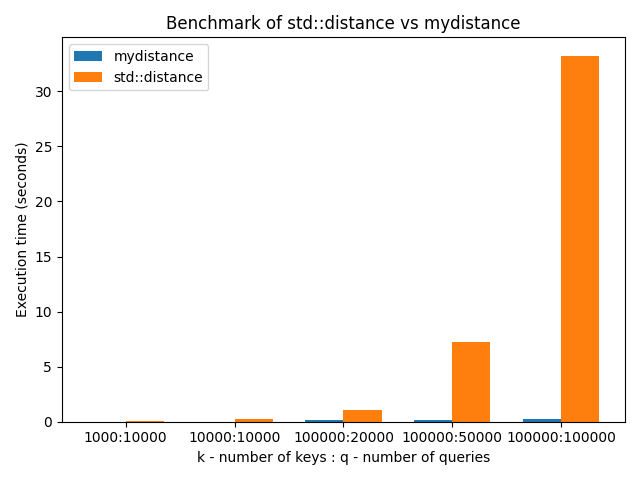

# Implementation of Red-Black tree and function distance

This repo consists of implementation of red-black tree and 
comparison functions std::distance and my_distance

## Building and running
```bash
cmake -DCMAKE_BUILD_TYPE=Release -S . -B build
cmake --build ./build
env CTEST_OUTPUT_ON_FAILURE=1 cmake --build build --target test
```

This creates to object files `./build/main_rbtree`, `./build/main_set` and `./build/gen_tests`.

Programs `./build/main_rbtree` and `./build/main_set` can take two flags `-t` and `-h`
`-t` - to show time of execution
`-h` - to hide responses for queries

Program `./build/gen_tests` generates tests. Parameters for tests it takes from `./gen_params.txt` and `./gen_params_benchmark.txt`.
Each row in these files consists of two numbers `n_k` and `n_q`. 

`n_k` is number of commands `k num`

`n_q` is number of commands `q l r`

By default `./build/gen_tests` reads parameters from file `./gen_params.txt` and writes tests in directory `./tests/`.
Each test has template `test_XXX.dat` and `test_XXX.ans`.

`test_XXX.dat` - consists correct responses

`./build/gen_tests` can take flag `-b`, that is reads parameters from `./gen_params_benchmark.txt` and writes to `./tests/benchmark/`


## Input
Input consists of sequence two types of commands "k n" and "q l r", where l < r.
Command "k n" inserts key in tree. Command "q l r" returns how many elements are between l and r.


## Output
The program output responses for queries.


## RBTree implementation
- Insert element in tree: O(log(n_k))
- Responding to request: O(log(n_k))
Total complexity: O(n_k * log(n_k) + n_q * log(n_k))

## std::set implementation
- Insert element in set: O(log(n_k))
- Responding to request: O(n_k)
Total complexity: O(n_k * log(n_k) + n_q * n_q)

## Benchmark

